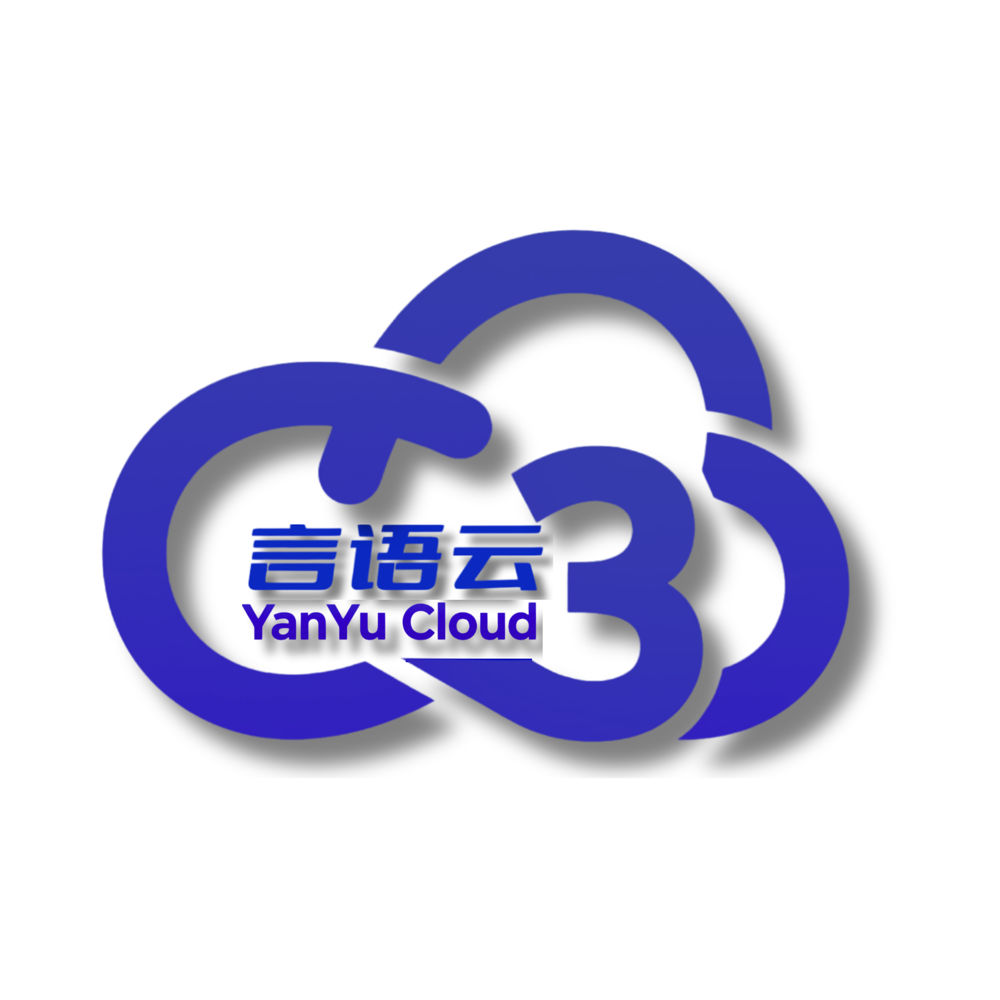

# 言语云³集成中心系统

<div align="center">
  
  
  <p align="center">
    <a href="https://github.com/" target="_blank">
      
    </a>
    <a href="https://nodejs.org/" target="_blank">
      
    </a>
    <a href="https://nextjs.org/" target="_blank">
      
    </a>
    <a href="https://www.typescriptlang.org/" target="_blank">
      
    </a>
    <a href="https://tailwindcss.com/" target="_blank">
      
    </a>
    <a href="https://opensource.org/licenses/MIT" target="_blank">
      
    </a>
  </p>
</div>

## 导航目录

- [项目简介](#项目简介)
- [核心功能](#核心功能)
- [技术栈](#技术栈)
- [项目结构](#项目结构)
- [快速开始](#快速开始)
- [系统架构](#系统架构)
- [API接口](#api接口)
- [开发指南](#开发指南)
- [部署说明](#部署说明)
- [许可证](#许可证)
- [联系我们](#联系我们)

## 项目简介

言语云³集成中心系统是一款专注于智能云服务集成与管理的综合平台，致力于为企业和开发者提供统一、高效、安全的云服务接入解决方案。通过标准化的API接口和丰富的集成组件，实现各类云服务的快速对接与灵活组合，助力业务创新与数字化转型。

## 核心功能

### 🔌 集成中心

- **丰富的集成组件**：提供AI助手、数据同步、加密服务等多种云服务集成模块
- **分类导航**：按功能、行业、热门程度等多维度分类展示集成组件
- **搜索与筛选**：支持关键词搜索和多条件筛选，快速找到所需组件
- **收藏与管理**：支持收藏常用集成，方便快速访问

### 🤖 AI助手服务

- **智能交互**：基于先进的AI模型提供自然语言交互能力
- **上下文理解**：具备多轮对话的上下文理解能力
- **自定义训练**：支持根据业务需求自定义训练AI模型
- **API集成**：提供标准化API接口，方便与其他系统集成

### 🔐 安全与权限管理

- **用户认证**：支持多种认证方式，确保用户身份安全
- **权限控制**：细粒度的权限管理，确保数据和功能的访问安全
- **数据加密**：敏感数据加密存储和传输
- **审计日志**：记录关键操作，便于追溯和审计

### 🔄 数据同步服务

- **跨平台同步**：支持不同系统间的数据同步与迁移
- **定时任务**：支持设置定时同步任务
- **数据映射**：灵活的数据字段映射配置
- **同步监控**：实时监控同步状态和性能

### 📊 管理监控

- **系统监控**：实时监控系统运行状态和性能指标
- **用户管理**：用户账户、角色、权限管理
- **配置中心**：统一管理系统配置参数
- **错误处理**：完善的错误处理和日志记录机制

## 技术栈

- **前端框架**：Next.js 14 + React 18
- **编程语言**：TypeScript 5
- **UI组件**：Tailwind CSS v3 + 自定义UI组件库
- **状态管理**：React Context API
- **API通信**：Fetch API + 自定义错误处理
- **构建工具**：Next.js内置构建系统
- **代码规范**：ESLint + Prettier + TypeScript
- **测试框架**：Jest

## 项目结构

```
├── app/                 # Next.js App Router应用目录
│   ├── about/           # 关于页面
│   ├── account/         # 账户管理相关功能
│   ├── admin/           # 管理后台
│   ├── ai-assistant/    # AI助手功能
│   ├── api/             # API路由
│   ├── components/      # 业务组件
│   ├── context/         # React Context状态管理
│   ├── services/        # 服务层
│   ├── styles/          # 样式文件
│   └── utils/           # 工具函数
├── components/          # 共享UI组件
├── docs/                # 文档
├── public/              # 静态资源
├── scripts/             # 辅助脚本
└── styles/              # 全局样式
```

## 快速开始

### 环境准备

- Node.js v18或更高版本
- npm/pnpm/yarn包管理器

### 安装依赖

```bash
# 使用pnpm（推荐）
pnpm install

# 或使用npm
npm install

# 或使用yarn
yarn install
```

### 开发模式

```bash
# 启动开发服务器
pnpm dev

# 访问 http://localhost:3000
```

### 构建与部署

```bash
# 构建生产版本
pnpm build

# 运行生产版本
pnpm start
```

## 系统架构

言语云³集成中心系统采用前后端分离的微服务架构，主要包括：

- **前端层**：基于Next.js的单页应用，提供用户界面
- **API网关**：统一的API入口，负责请求路由和权限验证
- **服务层**：各类业务服务，如集成管理、AI助手、数据同步等
- **数据层**：数据库和数据存储服务
- **集成适配器**：连接各类第三方云服务的适配器

## API接口

系统提供丰富的REST API接口，支持外部系统集成和自动化操作。详细API文档请参考[开发指南](docs/developer-guide.md)。

## 开发指南

请参考[开发者文档](docs/developer-guide.md)获取详细的开发指南、API文档和最佳实践。

## 部署说明

系统支持多种部署方式：

- **容器化部署**：提供Docker镜像，支持Docker Compose或Kubernetes部署
- **云平台部署**：支持主流云平台如阿里云、腾讯云、AWS等
- **传统部署**：支持直接部署到Linux服务器

详细部署步骤请参考部署文档。

## 许可证

本项目采用[MIT许可证](https://opensource.org/licenses/MIT)。

## 联系我们

- **邮箱**：[admin@0379.email](mailto:admin@0379.email)
- **官方网站**：[https://yanyu-cloud.com](https://yanyu-cloud.com)
- **GitHub**：[https://github.com/yanyu-cloud/integration-center](https://github.com/yanyu-cloud/integration-center)
